# Домашнее задание 3

**Выполнил - Третьяков Александр Юрьевич**

# Задание
1. Создайте в `MongoDB` базу данных для учёта оценок студентов
университета. Для этого необходимо выполнить следующие действия.
    - Спроектировать базу данных
    - Определить типовые запросы к базе данных (минимум 10 запросов)
    - Составить отчёт. Опишите, как устроена ваша база данных и почему. Незабудьте записать типовые запросы

Это задание на проектирование базы данных, а вы – архитекторы. Поэтому формулировка задания не содержит явных инструкций или ограничений.
Смоделируйте, как эта база данных будет использоваться студентами,
преподавателями и деканатом. Это поможет вам понять, какие данные нужно
в ней хранить и каким способом организовать хранение, а также ожидаемые
запросы к ней. Не забывайте про схемы и вторичные индексы.

# Решение 
Cоздадим базу и загрузим данные о студентах

Для этого воспользуемся скриптом `init_database.js` из каталога `\task_3\assets\create_db\`

```bash
mongosh init_database.js 
```


#### Модель базы данных после создания будет выглять следующим образом



### СВОДКА ПО СХЕМЕ БАЗЫ ДАННЫХ "GRADES_SYSTEM"

### КОЛЛЕКЦИИ (4)

### 1. **students** (студенты)
**Ключевые поля:**
- `recordbook` (PK): "2024-ПИ-001" - уникальный номер зачетки
- `full_name`: ФИО студента
- `group`: "ПИ-24-1" - учебная группа
- `specialty`: "Программная инженерия" - специальность
- `course`: 1-6 - курс обучения
- `status`: "active"/"graduated"/"expelled" - статус

### 2. **teachers** (преподаватели)
**Ключевые поля:**
- `teacher_id` (PK): "TCH-001" - уникальный ID преподавателя
- `full_name`: ФИО преподавателя
- `subjects`: ["INF-101", "INF-102"] - массив преподаваемых предметов
- `department`: "Кафедра программирования"
- `degree`: "кандидат наук" - ученая степень

### 3. **subjects** (предметы)
**Ключевые поля:**
- `subject_id` (PK): "INF-101" - уникальный ID предмета
- `name`: "Программирование" - название предмета
- `credits`: 4 - количество кредитов
- `semester`: 1-8 - семестр изучения
- `teachers`: ["TCH-001", "TCH-002"] - массив преподавателей
- `specialty`: "Программная инженерия" - для кого предмет

### 4. **grades** (оценки)
**Ключевые поля:**
- `recordbook` (FK → students.recordbook): "2024-ПИ-001"
- `subject_id` (FK → subjects.subject_id): "INF-101"
- `teacher_id` (FK → teachers.teacher_id): "TCH-001"
- `grade`: 2/3/4/5 или "зачет"/"незачет"
- `grade_type`: "экзамен"/"зачет"/"курсовая"
- `semester`: 1 - семестр
- `academic_year`: "2024-2025" - учебный год

## СВЯЗИ

### **Основные связи (foreign keys):**
1. `grades.recordbook` → `students.recordbook`
2. `grades.subject_id` → `subjects.subject_id`
3. `grades.teacher_id` → `teachers.teacher_id`

### **Неявные связи (через массивы):**
1. `teachers.subjects` ↔ `subjects.teachers` (многие-ко-многим)
2. `students.group` + `students.specialty` → `subjects.specialty`

## ВАЛИДАЦИЯ ДАННЫХ

### **Паттерны:**
- `recordbook`: `^\d{4}-[А-Яа-я]{2,3}-\d{3}$`
- `teacher_id`: `^TCH-\d{3}$`
- `subject_id`: `^[A-Z]{3,4}-\d{3}$`
- `group`: `^[А-Яа-я]{2,3}-\d{2}-\d$`
- `phone`: `^\+7\s\d{3}\s\d{3}-\d{2}-\d{2}$`

### **Перечисления:**
- `status` (students): active/graduated/expelled/academic_leave/transferred
- `grade` (grades): 2/3/4/5/"зачет"/"незачет"
- `grade_type`: экзамен/зачет/курсовая/практика

## ИНДЕКСЫ (9 индексов)

### **Уникальные:**
1. `recordbook` (students)
2. `teacher_id` (teachers)
3. `subject_id` (subjects)

### **Составные:**
1. `{semester: 1, specialty: 1}` (subjects)
2. `{recordbook: 1, subject_id: 1, semester: 1}` (grades)

### **Обычные:**
1. `group` (students)
2. `full_name` (students)
3. `full_name` (teachers)
4. `recordbook + semester`, `subject_id`, `teacher_id` (grades)

## ТИПИЧНЫЕ ЗАПРОСЫ К БАЗЕ

### **1. Найти оценки студента по номеру зачетной книжки:**
```js
db.grades.find({
    recordbook: "2023-ИТ-001",
    semester: 1
}).pretty()
```


### **2. Найти оценки студента по ФИО:**

```js
const res = db.grades.aggregate([
{
    $lookup: {
    from: "students",
    localField: "recordbook",
    foreignField: "recordbook",
    pipeline: [{ $match: { full_name: "Иванов Иван Иванович" } }],
    as: "s"
    }
},
{ $match: { s: { $ne: [] } } },
{
    $lookup: {
    from: "subjects",
    localField: "subject_id",
    foreignField: "subject_id",
    as: "subj"
    }
},
{ $unwind: "$subj" },
{
    $project: {
    _id: 0,
    sem: "$semester",
    date: { $dateToString: { format: "%d.%m.%Y", date: "$date" } },
    subject: "$subj.name",
    grade: 1
    }
},
{ $sort: { sem: 1, date: 1 } }
]).toArray();
```
```js
res.forEach(r => {
print(
    `${r.sem} | ` +
    `${r.date} | ` +
    `${r.subject.padEnd(35)} | ` +
    `${r.grade}`
);
});
```


### **3. Найти преподавателя и его предметы по ФИО:**

```js
const res = db.teachers.aggregate([
{ $match: { full_name: "Петров Сергей Иванович" } },
{
    $lookup: {
    from: "subjects",
    localField: "subjects",
    foreignField: "subject_id",
    as: "teaching"
    }
},
{
    $project: {
    _id: 0,
    name: "$full_name",
    dept: "$department",
    subjects: {
        $map: {
        input: "$teaching",
        as: "subj",
        in: {
            name: "$$subj.name",
            credits: "$$subj.credits",
            semester: "$$subj.semester"
        }
        }
    }
    }
}
]).toArray();
```
```js
    res.forEach(t => {
    print(`Преподаватель: ${t.name} (${t.dept})`);
    t.subjects.forEach(s => print(`  ${s.name} - ${s.credits} кр. (сем. ${s.semester})`));
});
```


### **4. Найти средний балл по предметам**

```js
const res = db.grades.aggregate([
{
    $lookup: {
    from: "students",
    localField: "recordbook",
    foreignField: "recordbook",
    pipeline: [{ $match: { course: 1 } }],
    as: "stud"
    }
},
{ $match: { stud: { $ne: [] } } },
{
    $lookup: {
    from: "subjects",
    localField: "subject_id",
    foreignField: "subject_id",
    as: "subj"
    }
},
{ $unwind: "$subj" },
{
    $group: {
    _id: "$subj.name",
    avg: { $avg: { $cond: [{ $in: ["$grade", [2,3,4,5]] }, "$grade", null] } },
    count: { $sum: 1 }
    }
},
{ $sort: { avg: -1 } }
]).toArray();
```
```js
res.forEach(r => {
    print(
        `${r._id.padEnd(35)} | ` +
        `${r.avg ? r.avg.toFixed(2) : ' -  '} | ` +
        `${r.count}`
    );
});
```


### **5. Найти средний балл по группам**
```js
const res = db.grades.aggregate([
{
    $lookup: {
    from: "students",
    localField: "recordbook",
    foreignField: "recordbook",
    as: "stud"
    }
},
{ $unwind: "$stud" },
{
    $group: {
    _id: "$stud.group",
    students: { $addToSet: "$stud.full_name" },
    avg: { $avg: { $cond: [{ $in: ["$grade", [2,3,4,5]] }, "$grade", null] } },
    grades: { $sum: 1 }
    }
},
{
    $project: {
    group: "$_id",
    students: { $size: "$students" },
    avg: { $round: ["$avg", 2] },
    grades: 1
    }
},
{ $sort: { avg: -1 } }
]).toArray();
```
```js
res.forEach(r => {
print(
    `${r.group.padEnd(8)} | ` +
    `${r.students.toString().padStart(2)} ст. | ` +
    `${r.avg ? r.avg : ' - '} | ` +
    `${r.grades} оц.`
    );
});
```


### **6. Найти студентов с неудовлетворительными оценками (2 или незачет)**

```js
const res = db.grades.aggregate([
{ $match: { grade: { $in: [2, "незачет"] } } },
{
    $lookup: {
    from: "students",
    localField: "recordbook",
    foreignField: "recordbook",
    as: "s"
    }
},
{ $unwind: "$s" },
{
    $group: {
    _id: "$s.full_name",
    group: { $first: "$s.group" },
    badCount: { $sum: 1 }
    }
},
{ $sort: { badCount: -1 } }
]).toArray();
```
```js
res.forEach(r => {
print(
    `${r._id.padEnd(25)} | ` +
    `${r.group} | ` +
    `${r.badCount} неуд.`
    );
});
```


### **7. Найти отличников: студентов с оценками 5**    

```js
const res = db.grades.aggregate([
{
    $lookup: {
    from: "students",
    localField: "recordbook",
    foreignField: "recordbook",
    as: "s"
    }
},
{ $unwind: "$s" },
{
    $group: {
    _id: "$s.full_name",
    group: { $first: "$s.group" },
    grades: { $push: "$grade" },
    count: { $sum: 1 }
    }
},
{
    $match: {
    grades: { $not: { $elemMatch: { $nin: [5, "зачет"] } } },
    count: { $gte: 3 }
    }
},
{ $sort: { count: -1 } }
]).toArray();
```
```js
res.forEach(r => {
print(
    `${r._id.padEnd(25)} | ` +
    `${r.group} | ` +
    `${r.count} оценок`
    );
});
```


### **8. Найти студентов по специальностям**       
```js
const res = db.students.aggregate([
{ $match: { status: "active" } },
{
    $group: {
    _id: "$specialty",
    count: { $sum: 1 },
    groups: { $addToSet: "$group" },
    avgCourse: { $avg: "$course" }
    }
},
{ $sort: { count: -1 } }
]).toArray();
```
```js
res.forEach(r => {
print(
    `${r._id.padEnd(30)} | ` +
    `${r.count.toString().padStart(2)} ст. | ` +
    `${r.groups.length} групп | ` +
    `курс ${r.avgCourse.toFixed(1)}`
    );
});
```


### **9. Найти распределение оценок по предмету (например МатАнализ)**

```js
const subject = "MATH-101";
const res = db.grades.aggregate([
{ $match: { subject_id: subject } },
{
    $lookup: {
    from: "subjects",
    localField: "subject_id",
    foreignField: "subject_id",
    as: "subj"
    }
},
{ $unwind: "$subj" },
{
    $group: {
    _id: "$grade",
    count: { $sum: 1 },
    students: { $push: "$recordbook" }
    }
},
{ $sort: { _id: 1 } }
]).toArray();
```
```js
const subjName = db.subjects.findOne({subject_id: subject}).name;
print(`${subjName}:`);

res.forEach(r => {
const percent = ((r.count / db.grades.countDocuments({subject_id: subject})) * 100).toFixed(1);
print(
    `  ${r._id.toString().padEnd(6)} | ` +
    `${r.count.toString().padStart(2)} | ` +
    `${percent}%`
    );
});
```
    


### **10. Найти распределение оценок по преподавателям**

```js
const res = db.grades.aggregate([
{
    $group: {
    _id: "$teacher_id",
    count: { $sum: 1 },
    avg: { $avg: { $cond: [{ $in: ["$grade", [2,3,4,5]] }, "$grade", null] } }
    }
},
{
    $lookup: {
    from: "teachers",
    localField: "_id",
    foreignField: "teacher_id",
    as: "t"
    }
},
{ $unwind: "$t" },
{
    $project: {
    name: "$t.full_name",
    count: 1,
    avg: { $round: ["$avg", 2] }
    }
},
{ $sort: { count: -1 } }
]).toArray();
```
```js
res.forEach(r => {
print(
    `${r.name.padEnd(25)} | ` +
    `${r.count.toString().padStart(3)} оц. | ` +
    `${r.avg ? r.avg : ' - '}`
    );
});
```
    


