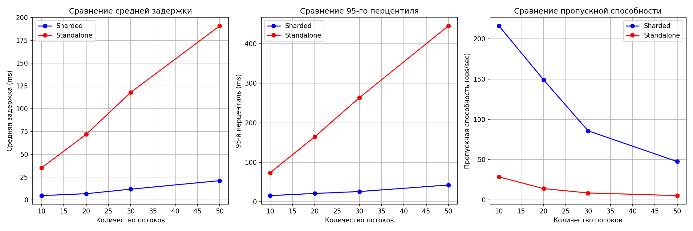

## 1. Цель работы

Разработать проект базы данных с горизонтальным масштабированием (шардингом) на примере MongoDB, включающий:
- Проектирование схемы данных для хранения информации о студентах университета
- Развёртывание распределённого кластера с тремя шардами
- Создание Python-скриптов для генерации данных и нагрузочного тестирования
- Сравнение производительности шардированного кластера с одиночным экземпляром MongoDB (standalone)
- Визуализацию и анализ полученных результатов

## 2. Схема базы данных

### 2.1. Выбор модели данных
Для реализации была выбрана **документоориентированная модель MongoDB**, так как она:
- Естественно представляет иерархические данные (студент → курсы)
- Поддерживает шардинг "из коробки"
- Позволяет гибко изменять структуру документов

### 2.2. Структура коллекции `students`

```javascript
{
  "_id": ObjectId,                // автоматический ID MongoDB
  "student_id": "100001",          // уникальный ID студента (шард-ключ)
  "name": "Иван Петров",
  "email": "ivan.petrov@university.ru",
  "faculty": "ФКН",                // факультет
  "enrollment_year": 2023,          // год поступления
  "courses": [                      // вложенные документы с курсами
    {
      "course_id": "CS101",
      "course_name": "Python для инженерии данных",
      "grade": 85,
      "semester": "fall_2025"
    },
    {
      "course_id": "MATH202",
      "course_name": "Математическая статистика",
      "grade": 92,
      "semester": "fall_2025"
    }
  ],
  "created_at": ISODate("2026-03-18T...")
}
```
### 2.3 Обоснование выбора шард-ключа
- Шард-ключ: student_id
- Тип: хешированный (hashed)
- Почему:
    - Обеспечивает равномерное распределение данных по шардам
    - Позволяет эффективно выполнять точечные запросы по student_id
    - Не зависит от других полей, которые могут меняться

### 2.4 Индексы
Помимо шардинга, создадим:
- Индекс по email для быстрого поиска
- Индекс по faculty для аналитических запросов
- Составной индекс faculty + enrollment_year для фильтрации

## 3. Архитектура шардированного кластера

### 3.1. Компоненты кластера
- **3 конфигурационных сервера** (`config1-3`) — хранят метаданные о распределении данных
- **3 шарда** (`shard1-3`) — непосредственно хранят данные студентов
- **Маршрутизатор mongos** — точка входа для клиентских приложений
- **Standalone MongoDB** — отдельный экземпляр для сравнения производительности

### 3.2. Сеть и порты
- Все контейнеры работают в одной сети `shard-network`
- Внешние порты:
  - `27017` → mongos (шардированный кластер)
  - `27018` → standalone (для сравнения)

### 3.3. Процесс настройки шардинга
1. Инициализация конфигурационных серверов как replica set
2. Инициализация каждого шарда как отдельного replica set
3. Добавление шардов в кластер через mongos
4. Включение шардинга для БД `university_db`
5. Создание хешированного индекса по `student_id`
6. Шардирование коллекции `students`

## 4. Реализация клиентского интерфейса

Для работы с данными реализованы два Python-скрипта:

### 4.1. Генерация данных (`generate_data.py`)
- Создаёт 100 000 записей о студентах
- Использует библиотеки `pymongo`, `faker`, `tqdm`
- Данные записываются одновременно в шардированный кластер и standalone

### 4.2. Нагрузочное тестирование (`load_test.py`)
- Реализует многопоточную нагрузку (10, 20, 30, 50 потоков)
- Смешанная нагрузка: 70% чтение, 30% запись
- Измеряет latency (avg, p95) и throughput
- Строит сравнительные графики

### 4.3. Консольный интерфейс (`client_interface.py`)

Для выполнения базовых операций с данными реализован интерактивный консольный клиент. Он подключается к шардированному кластеру через mongos и предоставляет меню с выбором действий:

- **Просмотр студентов** — выводит первых 10 студентов для быстрого ознакомления
- **Поиск по ID** — точный поиск студента по полю `student_id`
- **Добавление** — интерактивное создание новой записи
- **Обновление** — изменение имени и email студента
- **Удаление** — удаление записи по `student_id`
- **Статистика шардов** — отображение текущего распределения данных по узлам кластера (команда `getShardMap`)

Интерфейс реализован на Python с использованием библиотеки `pymongo` и предназначен для демонстрации работы с шардированной БД в реальном времени.

## 5. Анализ результатов нагрузочного тестирования

### 5.1. Сводная таблица результатов

| Потоки | Метрика | Шардированный | Standalone | Ускорение |
|--------|---------|----------------|------------|-----------|
| **10** | avg (ms) | 4.62 | 35.08 | **7.6x** |
|        | p95 (ms) | 15.76 | 73.65 | **4.7x** |
|        | ops/sec | 216 | 29 | **7.4x** |
| **20** | avg (ms) | 6.70 | 71.75 | **10.7x** |
|        | p95 (ms) | 21.15 | 164.69 | **7.8x** |
|        | ops/sec | 149 | 14 | **10.6x** |
| **30** | avg (ms) | 11.66 | 117.85 | **10.1x** |
|        | p95 (ms) | 26.00 | 263.43 | **10.1x** |
|        | ops/sec | 86 | 8 | **10.8x** |
| **50** | avg (ms) | 21.00 | 190.92 | **9.1x** |
|        | p95 (ms) | 42.54 | 445.12 | **10.5x** |
|        | ops/sec | 48 | 5 | **9.6x** |

### 5.2. Графики производительности

 

*График 1: Сравнение средней задержки (ms)*  
*График 2: Сравнение 95-го перцентиля (ms)*  
*График 3: Сравнение пропускной способности (ops/sec)*

Результаты консоли

 

### 5.3. Ключевые выводы

#### 5.3.1. Масштабируемость шардированного кластера

- При увеличении нагрузки с 10 до 50 потоков средняя задержка в шардированном кластере выросла с **4.62 ms до 21.00 ms** (рост в 4.5 раза)
- В standalone задержка выросла с **35.08 ms до 190.92 ms** (рост в 5.4 раза)
- **Шардирование эффективнее справляется с ростом нагрузки**

#### 5.3.2. Стабильность времени ответа

- **p95 метрика** показывает, что шардированный кластер даёт более предсказуемое время ответа:
  - При 50 потоках p95 = 42.54 ms (всего в 2 раза выше среднего)
  - В standalone p95 = 445.12 ms (в 2.3 раза выше среднего, но абсолютные значения критичны)
- Разрыв между средним и 95-м перцентилем остаётся стабильным в шардированном варианте

#### 5.3.3. Пропускная способность

- Шардированный кластер обрабатывает **в 7-10 раз больше запросов в секунду**
- При 10 потоках: 216 ops/sec vs 29 ops/sec
- При 50 потоках: 48 ops/sec vs 5 ops/sec
- Падение пропускной способности с ростом потоков ожидаемо, но шардированный вариант падает медленнее

### 5.4. Заключение

Результаты тестирования наглядно демонстрируют **эффективность горизонтального масштабирования (шардинга)**:

- **До 10 раз лучше** по времени ответа
- **До 10 раз выше** пропускная способность
- **Более предсказуемое** поведение под нагрузкой
- **Лучшая деградация** при увеличении числа concurrent запросов

Шардирование позволяет эффективно распределять нагрузку между тремя узлами, в то время как standalone MongoDB упирается в ограничения одного сервера. При увеличении количества одновременных запросов преимущество шардированного кластера становится только очевиднее.